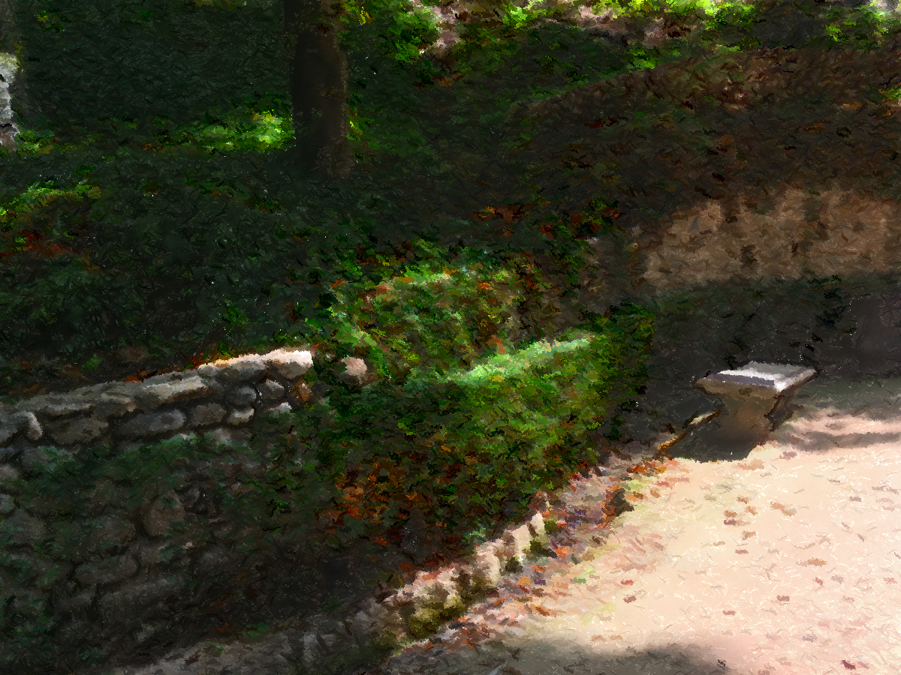

# NPR

A collection of filters useful in non-photorealistic post-processing

## How to build

*Windows*

Open git bash to the directory containing this repository.

```
project-template $ mkdir build
project-template $ cd build
project-template/build $ cmake ..
project-template/build $ start NPR.sln
```

To run from the git bash command shell, 

```
project-template/build $ ../bin/Debug/demo.exe
```

*macOS and unix*

Open terminal to the directory containing this repository.

```
project-template $ mkdir build
project-template $ cd build
project-template/build $ cmake ..
project-template/build $ make
```

To run each program from build, you would type

```
project-template/build $ ../bin/pixmap_art
```

## Examples

Original Image.


Crosshatching filter.


Painting filter.


Cartoon filter.


## Filters

- Gaussian Blur (directed and undirected)
- Extended Difference of Gaussians
- Painterly Filter
- Color Quantization
- Histogram Equalization


## Resources and References

Kyprianidis, J., Kang, H., & D¨ ollner, J. (2010). Anisotropic Kuwahara filtering on the GPU (W. Engel, Ed.). 

H. Winnemöller, S. C. O., J. E. Kyprianidis. (2012). Xdog: An extended difference-of-Gaussians compendium including advanced image stylization. Computers & Graphics, 36(6), 740–753. https://doi.org/10.1016/j.cag.2012.03.004

Wikipedia, 2. (2024, March 5). Histogram equalization [In Wikipedia]. https://en.wikipedia.org/wiki/Histogram equalization
